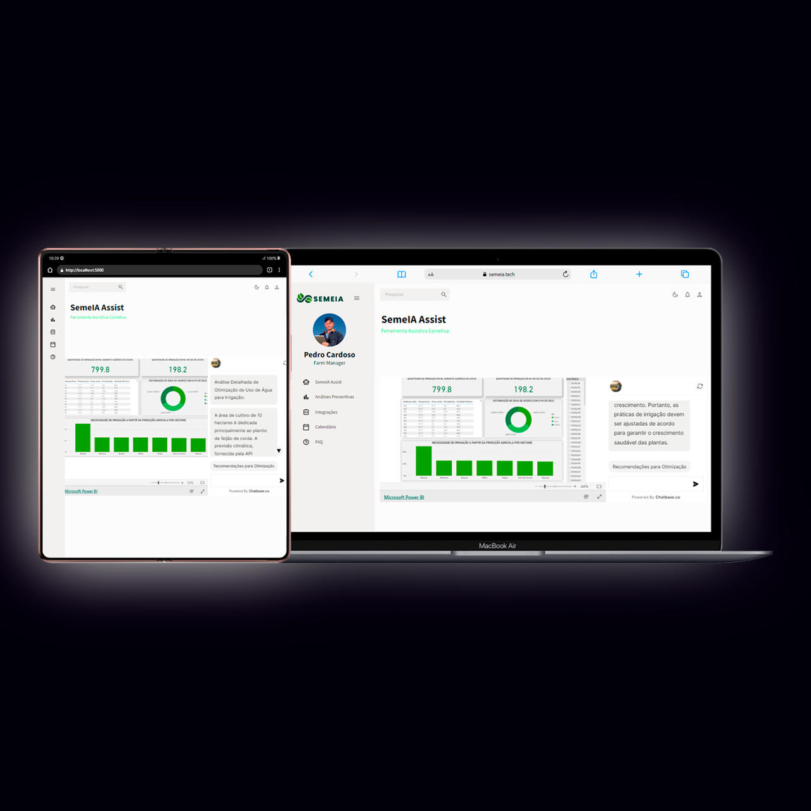

# Desafio Técnico - SemeIA: Sistema de Estimativa e Monitoramento com Inteligência Artificial para Agronegócio

<p></p>

## 🔗 **Confira o Resultado** [clicando aqui.](https://semeia.tech/)

Este projeto, desenvolvido pela equipe Coders Ceará, para o Hackathon que aconteceu durante o evento Expolog 2023, tendo como proposta trazer uma resposta inovadora aos desafios do agronegócio sustentável e eficiente. O SemeIA (Sistema de Estimativa e Monitoramento com Inteligência Artificial para Agronegócio) é projetado para centralizar informações cruciais para agro-empresários, oferecendo análises em tempo real e integrando tecnologia avançada para otimizar a gestão agrícola.

## 📋 Roteiro do Brainstorm

- **Desenvolver um sistema integrado para o agronegócio:**
  - Centralizar informações relevantes em um único sistema.
  - Aplicar análises baseadas em dados reais para oferecer insights valiosos.

- **Utilizar tecnologias avançadas:**
  - Implementar Machine Learning para análises preventivas.
  - Integrar soluções inteligentes e dispositivos IoT.

- **Construir funcionalidades chave:**
  - SemeIA Assist: Painel de controle para visualização de dados em infográficos.
  - Análises Preventivas: Utilização de Machine Learning para prever e prevenir problemas.
  - Integrações: Compatibilidade com dispositivos IoT existentes.

## 🛠️ Tecnologias Utilizadas
- **React**: Biblioteca JavaScript para construção de interfaces.
- **Material UI**: Biblioteca de componentes React.
- **Data Grid**: Componente para visualização de dados.
- **Machine Learning**: Tecnologia para análises preditivas.

## 🚀 Funcionalidades
1. **SemeIA Assist**: Visualização interativa de dados relevantes.
2. **Análises Preventivas**: Previsões baseadas em Machine Learning.
3. **Integrações com IoT**: Compatibilidade com uma variedade de dispositivos.
4. **Gerenciamento de Equipes**: Ferramenta administrativa para gestão de equipes.
5. **Calendário Multifuncional**: Organização de eventos e atividades agrícolas.
6. **FAQ**: Suporte para dúvidas frequentes.

> **Nota**: O sistema foi criado com o objetivo de tornar o agronegócio mais sustentável e eficiente, oferecendo uma solução tecnológica abrangente.

## 🖥️ Vídeo Demonstrativo

[Link do vídeo demonstrativo do projeto SemeIA](https://github.com/semeia/assets/135539245/c05ce778-573f-434a-b273-4be6874140d5)

## 📝 Notas Importantes

> **Segurança e Privacidade**: Implementamos medidas rigorosas para garantir a segurança e a privacidade dos dados dentro do sistema SemeIA.

# 💻 Como Executar o Projeto

Para executar o projeto localmente, siga os passos abaixo:

1. **Clone o repositório para sua máquina local:**

    ```sh
   git clone https://github.com/loandre/ExpoLogHack.git
   
2. **Navegue até o diretório do projeto:**
	
 	```cd
 	[Nome do Projeto]
 
3. **Instale as dependências necessárias:**
	
 	```sh
 	npm install
    
    ou

    npm install --force
 
4. **Execute o projeto:**
	
 	```sh
 	npm start

# 🌟 Agradecimentos
Agradecimentos especiais ao idealizador e organizador do evento do Hackathon, Marco Riveiros, e à equipe Coders Ceará, cuja colaboração foi essencial para a realização deste projeto. Agradecemos também a todos os agro-empresários e especialistas que contribuíram com insights valiosos durante o desenvolvimento do SemeIA.


